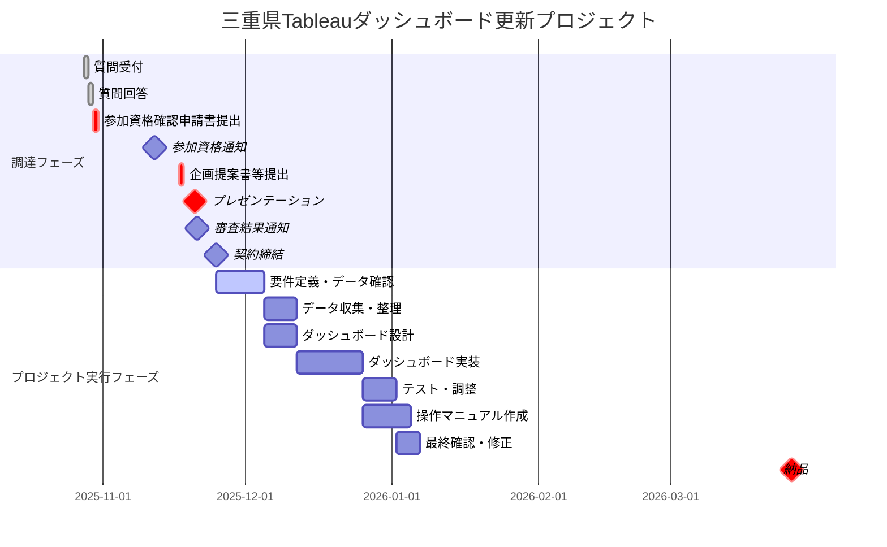

# 案件概要

案件名：観光統計データに係るダッシュボード改修等業務委託
契約期間：契約日から令和８年３月２６日（木）まで

## 案件サマリ

### 目的背景

本県では、市町・DMO 等における EBPM（Evidence Based Policy Making：データ等の合理的根拠に基づいた政策立案）の推進を目的として、三重県の様々な観光統計データを分析しやすい形で視覚化し、市町・DMO 等が活用できるよう Web サイト「三重県観光統計データ」（https://www.tourism-statistics.pref.mie.lg.jp/）（以下、「HP」という）を公開・運用している。

1. データに基づいたインバウンド戦略の策定など、**データに基づき観光施策を推進**していくこと。
2. DMO の登録制度にかかるガイドラインが改定され、観光地経営戦略の策定の義務化、KGI 及び KPI の設定に伴う各種データ等の収集及び分析ができる仕組みの構築などが DMO の登録要件とされたこと。など、データ収集・分析の重要性が高まっていることから、本業務では、市町・DMO 等における EBPM のさらなる推進のために、**収集したデータの HP への掲載について、その視認性・利便性などを高め、利用促進を図ることを目的**とする。

### 業務委託内容

#### 1.Tableau ダッシュボード改修等業務

観光庁の宿泊旅行統計の HP への掲載について、現状課題をふまえ、それを解決するために最適と考える手法を提案

- **前提条件**
    - 観光庁の宿泊旅行統計（三重）のHP に Tableau ダッシュボードによりデータを掲載（[みえ旅おもてなしプラットフォーム](https://www.tourism-statistics.pref.mie.lg.jp/data/3/)）
    - 上記利用ターゲットユーザは、**三重県内の市町・DMO・観光協会を含むユーザ**
- **現状課題**
    - UXが悪い：利用者が求めるものを即座に提供できない
        - HP に掲載しているグラフ(データ)が多く、必要とするグラフを探し出しにくい（視認性・利便性の課題）
        - 国・地域別外国人延べ宿泊者数について、円グラフのみであり、詳細に分析しにくい（利便性の課題）
        - 「延べ宿泊者数」を把握できない（利便性の課題）
            - 「観光目的の宿泊者 50％以上」と「観光目的の宿泊者５０％未満」の合計が「延べ宿泊者数」とは異なっている
    - 更新作業にの手間がかかる：手作業が多くかつ負荷も高い
        - 観光庁宿泊旅行統計「〇年（令和〇年）〇月分（第２次速報値) 集計結果」の各シートを手動で転記していることから、前処理の作業量が多い。
        - 年間の確報値が年に 1 度公表されるが、その際に更新が必要なファイルが 12か月分発生し、作業量が多い
- **提案前提条件**
    - **必須要件** 
        - HP には、「延べ宿泊者数」及び「客室稼働率」を最低限掲載するものとし、視認性・利便性に考慮した Tableau ダッシュボード案を提案する
        - このとき「合計(日本人＋外国人)、日本人、外国人ごとの着地データ」、「外国人については国・地域ごと、日本人については居住地ごと(都道府県ごと)の発地データ」などが都道府県別に把握できるとともに、見やすく使いやすい内容となるよう工夫する
        - 宿泊旅行統計のローデータを活用し、最低限、延べ宿泊者数（合計、日本人、外国人別）については、県内地域別の状況を掲載できるようにする
        - 掲載期間は 2017 年以降とし、契約期間内において、2017 年～最新まで更新を行う
        - 契約期間終了後においても、職員自身がデータソースにデータを追加し、Tableauダッシュボードに最新のデータが常に表示されるような仕組みを構築
        - 手法については、マクロの活用等、様々なものが想定されるが、可能な限り簡易な手法を提案し、操作マニュアルを作成すること。
        - 三重県内の市町・DMO・観光協会等が活用することを想定し、三重県の結果を見やすくすることや、同月比較、年比較、他地域比較、他都道府県比較など分析が容易にできるものとする
    - **発展的提案**
        - 宿泊旅行統計内のデータのうち、「延べ宿泊者数」「客室稼働率」以外で、Tableauダッシュボードに掲載すべきものがあれば、提案する
        - 例えば、三重県観光振興基本計画において目標項目となっている「平均宿泊日数」は掲載することが望ましい
    - **制約事項**
        - 公開中の宿泊旅行統計の Tableau ダッシュボードのファイルについては、県から提供可能であるが、データソースについては Tableau Prep Builder を用いて作成していることから、Tableau Prep Builder に接続するためのデータのみ提供すること

#### 2. レポート機能の構築

#### 3. その他業務

## 参考情報（入札条件）

- 業務仕様書([PDF](https://www.pref.mie.lg.jp/common/content/001222980.pdf)(576KB))
- 企画提案コンペ参加仕様書([PDF](https://www.pref.mie.lg.jp/common/content/001222937.pdf)(376KB))
- （第１～４号様式）参加資格確認申請書等([ワード](https://www.pref.mie.lg.jp/common/content/001222707.docx)(26KB))
- （第５号様式）企画提案申請書([ワード](https://www.pref.mie.lg.jp/common/content/001222708.doc)(32KB))
- （第６号様式）質問申請書([ワード](https://www.pref.mie.lg.jp/common/content/001222709.docx)(20KB))
- （第７号様式）契約実績証明書([ワード](https://www.pref.mie.lg.jp/common/content/001222710.doc)(33KB))
- （第８号様式）共通債権者登録申出書([エクセル](https://www.pref.mie.lg.jp/common/content/001222711.xls)(108KB))
- 業務委託契約書（案）([PDF](https://www.pref.mie.lg.jp/common/content/001222712.pdf)(276KB))

---

## 内容整理

### プロジェクト概要

三重県では、市町・DMO等におけるEBPM(Evidence Based Policy Making:データ等の合理的根拠に基づいた政策立案)の推進を目的として、[三重県観光統計データ](https://www.tourismstatistics.pref.mie.lg.jp/)を公開・運用している。

本業務は、観光庁の宿泊旅行統計をTableauで可視化した既存ダッシュボードの改修と、データ更新作業の効率化を図るもの。

**主な業務内容:**

1. **Tableauダッシュボード改修等業務**
   - 既存の宿泊旅行統計ダッシュボードの視認性・利便性向上
   - データ更新作業の簡易化・効率化
   - 職員が自身でデータ更新できる仕組みの構築

2. **レポート機能の構築**
   - 宿泊旅行統計(延べ宿泊者数、客室稼働率)の月次レポート出力機能
   - 観光施設入込客数との比較レポート機能

**契約期間:** 契約締結日 ～ 令和8年3月26日(木)

### 解決すべき課題

#### 背景

1. **データに基づいたインバウンド戦略の策定**: データに基づき観光施策を推進していく必要性
2. **DMO登録要件への対応**:
   - 観光地経営戦略の策定の義務化
   - KGI及びKPIの設定に伴う各種データ等の収集及び分析ができる仕組みの構築
3. **データ利用促進**: 収集したデータのHPへの掲載について、視認性・利便性を高め、市町・DMO等のEBPMをさらに推進する

#### 現状の課題

##### 掲載内容に関する課題

1. **視認性・利便性の問題**
   - [現在のダッシュボード](https://www.tourism-statistics.pref.mie.lg.jp/data/3/)に掲載されているグラフ(データ)が多すぎる
   - 市町・DMO・観光協会等のユーザーが必要とするグラフを探し出しにくい

2. **外国人延べ宿泊者数データの分析不足**
   - [国・地域別外国人延べ宿泊者数](https://www.tourism-statistics.pref.mie.lg.jp/data/3/3-7/)について、円グラフのみの掲載
   - データを詳細に分析するには不十分

3. **延べ宿泊者数の表示不整合**
   - 観光庁宿泊旅行統計第2表の「延べ宿泊者数」は、「観光目的の宿泊者50%以上」+「観光目的の宿泊者50%未満」の合計と異なる
   - 現在のHPグラフでは「観光目的の宿泊者50%以上」と「50%未満」のみ表示
   - 第2表の「延べ宿泊者数」そのものを把握できない

##### 更新作業に関する課題

1. **手動転記作業の負担**
   - 観光庁の集計結果エクセルファイルの各シートを、手動でマージファイルに転記
   - 前処理の作業量が多い

2. **年次確定値更新の負担**
   - 年間確報値公表時に12か月分のファイル更新が必要
   - 作業量が多い

### プロジェクトスケジュール

たたき台程度のスケジュール案です。
長期休暇などを考慮して調整する必要があります。

**スケジュール詳細:**

- **調達期間**: 2025年10月28日 ～ 2025年11月下旬
  - 質問受付: 10/28まで
  - 質問回答: 10/29まで(県HP掲載)
  - 参加資格確認申請: 10/30まで
  - 参加資格通知: 11/12目途
  - 企画提案書提出: 11/17まで
  - プレゼンテーション: 11/20(対面orオンライン)
  - 審査結果通知: 11/21予定(参加者通知・県HP公表)
  
- **委託期間**: 契約締結日 ～ 2026年3月26日
  - 想定工数: 約1人月
  - 主要タスク:
    - 要件定義・データ確認(約2週間)
    - データ収集・整理(約1週間)
    - ダッシュボード設計・実装(約3週間)
    - テスト・調整(約1週間)
    - マニュアル作成(並行実施)
    - 最終確認・納品準備(約1週間)

### 前提条件

#### HP公開・運用に関する要件

- 成果物はホームページ上で公開できるようにする
- 契約期間終了後も三重県が独自運用できるようにする
- 三重県内の市町・DMO・観光協会等が活用することを想定

#### ダッシュボードに関する要件

**必須掲載項目:**

- 延べ宿泊者数(最低限)
- 客室稼働率(最低限)
- 合計(日本人+外国人)、日本人、外国人ごとの着地データ
- 外国人: 国・地域ごとの発地データ
- 日本人: 居住地ごと(都道府県ごと)の発地データ
- 県内地域別の状況(ローデータ活用)

**推奨掲載項目:**

- 平均宿泊日数(三重県観光振興基本計画の目標項目)
- その他、提案により追加可能

**機能要件:**

- 視認性・利便性に考慮した設計
- 都道府県別に把握可能
- 同月比較、年比較、他地域比較、他都道府県比較が容易
- **三重県の結果が見やすいこと**

**データ期間:**

- 掲載期間: 2017年以降
- 契約期間内に2017年~最新まで更新を行う

#### データ更新に関する要件

- 職員自身がデータソースにデータを追加できる仕組み
- Tableauダッシュボードに最新データが常に表示される
- 可能な限り簡易な手法(マクロ活用等)
  - 三重県のPC環境で動作する必要あり(特殊な環境は不可)
- 操作マニュアルの作成が必須

#### システム

**データソース:**

- 観光庁宿泊旅行統計調査([リンク](https://www.mlit.go.jp/kankocho/tokei_hakusyo/shukuhakutokei.html))
  - 月次データ: 2次速報値の集計結果
  - 年次データ: 1月~12の集計結果
  - ローデータ: 観光庁提供(項目は調査票を参照)
- 観光施設入込客数(月次): HP掲載データ

**BIツール:**

- Tableau
  - Creatorライセンスを三重県が既に所持
  - ライセンス取得費用は考慮不要
- Tableau Prep Builder(使用する場合)
  - フローをステップごとに文書化し職員にレクチャーすること

**その他:**

- 県の環境において動作確認を実施
- ツール不具合時は速やかに対応、または代替手法を提案
- Tableauツール全般の操作支援(Web会議、電話対応等)
- 既存のTableauファイルは県から提供可能(データソースはPrep Builder接続用データのみ)

### ゴール・アウトプット

#### 1. Tableauダッシュボード改修

**成果物:**

- Tableauワークブック(.twbx)
- データソース(.xlsx)

#### 2. レポート機能

**成果物:**

- 月次レポート出力機能
  - 出力形式: Excel・Word等、修正が容易な形式

#### 3. ドキュメント類

**必須:**

- Tableauダッシュボード更新操作マニュアル
  - 職員が自力で更新できるレベルの内容
  - データソースへのデータ追加手順
  - ダッシュボードへの反映手順
  - トラブルシューティング
- Tableau Prep Builderフロー説明書(使用する場合)
  - ステップごとの処理内容
  - パラメータ設定の説明
- 必要書類(委託業務完了報告書等)

#### 4. サポート・レクチャー

- Tableau Prep Builderのレクチャー(使用する場合)
- Tableauツール全般の操作支援
  - Web会議、電話による問い合わせ対応
  - 契約期間中の継続的なサポート

#### 5. 納品期限

- 令和8年3月26日(木)

**参考(仕様書より):**

> ４ 納入成果物 ダッシュボードを作成する業務においては、ワークブック（.twbx）及びデータソース（Excel）に加えて、Tableauダッシュボード更新にかかる操作マニュアルや必要書類等を提出すること。

### やらないこと

#### システム開発・ライセンス関係

- Tableauライセンスの新規取得(県が既に所持)
- 新規システム・アプリケーションの開発
- サーバー構築・インフラ整備

#### データ収集・作成

- 観光庁以外の新規データソースの収集・整理
- 三重県独自の観光統計調査の実施

**注記:**

- 契約期間終了後も職員が自力で運用できる仕組みの構築が前提

## 必要経費

### 想定工数

- **約1人月程度**
  - 契約期間: 契約締結日 ～ 令和8年3月26日(約4ヶ月間)
  - 実作業期間を考慮した工数配分

### 費用内訳の考え方

#### 含まれる費用

- **人件費**
  - 要件定義・ヒアリング
  - ダッシュボード設計・実装
  - レポート機能開発
  - データ整備(2017年~最新)
  - テスト・調整
  - マニュアル作成
  - レクチャー・操作支援

- **動作確認・トラブル対応費用**
  - 県環境での動作確認
  - 不具合発生時の対応
  - 代替手法の提案(必要時)

- **その他**
  - 打ち合わせ費用(Web会議、対面)
  - 成果物作成費用
  - 納品関連費用

#### 含まれない費用

- Tableauライセンス費用(県が既に所持)
- サーバー・インフラ費用(既存環境を利用)
- 契約期間終了後の運用・保守費用

### 費用算出の考慮事項

1. **既存資産の活用**
   - 現行ダッシュボードファイルの提供あり
   - Tableau環境は県に既存

2. **スコープの明確化**
   - ダッシュボード改修(新規構築ではない)
   - 2017年~最新データの一括更新を含む
   - レポート機能の構築を含む

3. **成果物の品質担保**
   - 操作マニュアル作成
   - レクチャー実施
   - 契約期間中の操作支援

4. **リスク対応**
   - ツール不具合時の対応
   - 代替手法の提案能力

