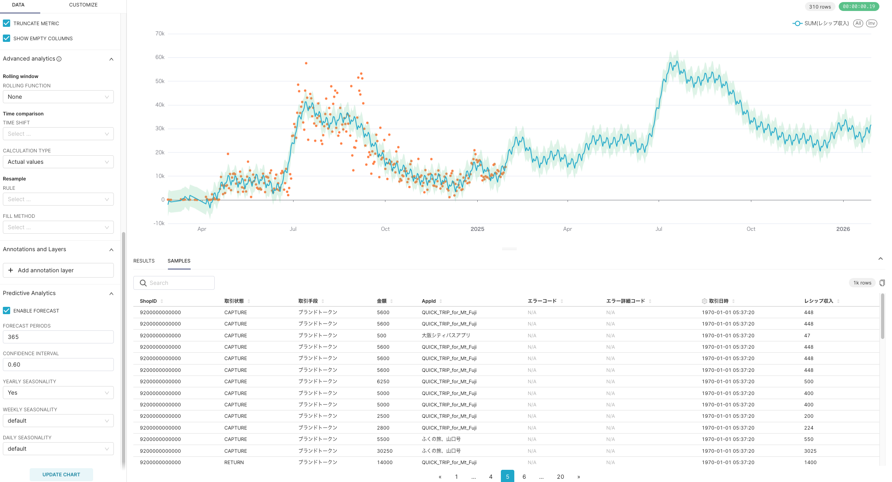

# データ分析を実現するための技術

## この資料の役割

データ分析を実現するためには、エコシステムの恩恵を受ける必要がある。

なぜならば、データ分析界隈の技術は複雑かつ技術スピードは非常に早いため、独自に開発することは、すぐに技術的負債を受けてしまう可能性が高いからである。

そのため、今はどの会社も様々なサービスを組わせてデータ分析を行ない、時代やビジネスの変化に合わせて柔軟に変化してい仕組を整えるのが主流である。

この資料では、**いまよく使われているサービスを整理し、技術選定に役立つための情報を一元管理する**ことで選定時に戦略をもって判断できるようにすることを目的にする。

## 目次

<!-- @import "[TOC]" {cmd="toc" depthFrom=1 depthTo=3 orderedList=false} -->

<!-- code_chunk_output -->

 AWS-Firehose
- [データ分析を実現するための技術](#データ分析を実現するための技術)
  - [この資料の役割](#この資料の役割)
  - [目次](#目次)
  - [技術比較表（サマリ）](#技術比較表サマリ)
  - [整理のしかた](#整理のしかた)
  - [データ収集](#データ収集)
    - [Amazon Date Firehose](#amazon-date-firehose)
  - [データ保存](#データ保存)
  - [データ加工](#データ加工)
    - [dbt（Data Build Tool）](#dbtdata-build-tool)
  - [データ分析・活用](#データ分析活用)
    - [Google Looker Studio](#google-looker-studio)
    - [Apache Superset](#apache-superset)
    - [雛形](#雛形)

<!-- /code_chunk_output -->

## 技術比較表（サマリ）

TODO:以下で整理した内容をマトリクスで比較表としてまとめる、マトリクス要素については要相談。

## 整理のしかた

データ分析を行うにあたり必要なデータ分析基盤は４つの要素で分類されるため、以下４分類ごとに整理することにする。

- データ収集
- データ保存
- データ加工
- データ分析・活用

※ただし、サービスによっては複数を跨いで対応できる場合があるため、その場合はメイン機能で整理する

---

## データ収集

データ分析のためには、業務システムや顧客データなどから必要なデータを集めます。収集したデータはそのままでは使えないことが多いため、適切に保存し、用途に応じて加工します。

### Amazon Date Firehose

[Amazon Date Firehose](https://aws.amazon.com/jp/firehose/)

#### 1. できることの概要

センサーなどから取得したデータを一定時間バッファリングし、一定量ごとにまとめて処理するシステム。

- 多種大量のデータをデータレイクなどの保管場所へ保存。
  - データ形式は自由
- 保存前にフォーマット変換処理が可能
  - 変換元はJSONのみ
  - 変換先は[Apache Parquet](https://parquet.apache.org/) ・ [Apache ORC](https://orc.apache.org/)の二種類。両方とも列指向データ形式で、これによりクエリ速度の向上が見込める。
  - 直接処理できないCSV等はLambdaで変換することで利用できる。

#### 2. サービスの特徴

- スケーラビリティが高い
- 現在のシステムに追加する形で導入可能
- 取得データの保存先がS3の場合は動的パーティショニングができる。[(参考)](https://docs.aws.amazon.com/ja_jp/firehose/latest/dev/dynamic-partitioning.html)
  - これによりデータの中身を参照してディレクトリに振り分けることが可能
- データIN/OUTについて
  - データソース
    - Direct PUT:API経由で直接Firehoseにデータを書き込む
      - AWS Lambda
      - AWS SDK
      - AWS CloudWatch
      - その他いろいろ
    - Amazon Kinesis Data Streams:既存のDataStreamsと接続するためのコネクタ
    - Amazon MSK:Amazon MSKと連携する場合にはそれ用のコネクタを使う
    - 何かしらのロジックを入れることで、外部サービスとの連携やセンサーの生データなども受け入れ可能
  - データの送信先
    - Amazon Simple Storage Service (Amazon S3)
    - Amazon Redshift
    - Amazon OpenSearch Serverless
    - Amazon OpenSearch Service
    - Splunk
    - Datadog
    - Dynatrace
    - LogicMonitor
    - MongoDB
    - New Relic
    - Coralogix
    - Elastic
    - HTTPエンドポイント
  - [デベロッパーガイドの該当ページ](https://docs.aws.amazon.com/ja_jp/firehose/latest/dev/create-name.html)

#### 3. 価格

- データ処理量比例
  - DirectPutAPI経由で取得した情報をそのままS3に置く場合：$0.036/GB
    - 動的パーティショニングをする場合
      - データ量課金:$0.032/GB
      - データ数課金:$0.008/1000レコード
    - サイズが5kB未満のレコードは5kBで換算
  - その他取得元、送信先によって料金が変動する

#### 4. 技術的に優れていること

- AWSのシステムとの連携がとりやすい
- AWSのマネージドサービスであり、安定してる。
- 運用中のシステムに追加する形でバックエンドをデプロイできる
- 自動暗号化・自動スケーリング機能あり

#### 5. 制約事項

- AWSを使用する必要がある
- データを変換する場合はS3にしか置けない
- 詳細な変換が難しい
  - Lambdaを経由して一つ一つロジックを書く必要がある
- 投げ込む際に書式を整える必要性がある
  - Bufferで投げ込んでも解釈でき、Jsonを入力しても使える。しかし、同等のデータを入れた時に入力形式により出力結果が異なる場合がある。後で分析する際に障壁となることがある。
- 1レコード当たりのサイズ上限が1000KB。

#### 6. 他社事例

- [NerdWallet](https://aws.amazon.com/jp/blogs/big-data/how-nerdwallet-uses-aws-and-apache-hudi-to-build-a-serverless-real-time-analytics-platform/)
- リアルタイム分析プラットフォームを構築する際に、差分アップデートを可能にするアーキテクチャが必要になり、Firehoseを利用するアーキテクチャになった。
  - 

#### 7. 世の中の評価・評判

- AWS上でリアルタイム性を求めないデータ配信を行う際の第一候補
  - データを集めて、ストレージに配信するまでのディレイが秒単位で発生する。
- AWS上のサービスではKinesis Data Streamsとの比較になることが多い
  - センサーやログファイルからの情報を取得しストレージに記録するようなツールにはFirehoseが向いているとの評価
  - 位置情報をもとにその場のおすすめを出したり、リアルタイムでトラフィックを調整するといった用途には向かない。
  
|   Data Streamsとの比較   |   Amazon Kinesis Data Streams  |  Amazon Data Firehose   |
| --- | --- | --- |
|   スループットを意識した設計   |  必要 |  不要   |
|   レイテンシ  |   ミリ秒単位  |   秒単位  |
|   配信先  |  処理を行うサービス   |  ストレージにも配信可能   |
|   用途  |  リアルタイム表示 位置情報のトラッキング   |  遅延が許容される分析 データレイクへのパイプライン   |

#### 8. 用途についての所感

- QUICKRIDEの位置情報収集での使用実績もあるのでとっつきやすい
- 一度S3に全部投げ込むといった用途に最適か
- 最低限の下処理しかできないので、個人情報をマスクするなどの要件がある場合は工夫が必要
- **送り込んだデータをそのままS3に置くのでデータを送る際はちゃんとすり合わせてから置く必要がある**

#### 9. 備考

- [2024-02-09ごろまではAmazon Kinesis Data Firehoseだった](https://aws.amazon.com/jp/about-aws/whats-new/2024/02/amazon-data-firehose-formerly-kinesis-data-firehose/#:~:text=AWS%20%E3%81%AF%20Amazon%20Kinesis%20Data,Firehose%20%E3%81%AB%E5%A4%89%E6%9B%B4%E3%81%97%E3%81%BE%E3%81%99%E3%80%82)ので新しい資料でもKinesisと一緒になっていたり、Kinesisの別サービスとの比較が主になっていたりする。
  
##### 10. 参考サイト

- [Amazon Data Firehose](https://aws.amazon.com/jp/firehose/)
- [Amazon Data Firehose デベロッパーガイド](https://docs.aws.amazon.com/ja_jp/firehose/latest/dev/what-is-this-service.html)
- [Amazon Kinesis Data Firehose改めて「Amazon Data Firehose」とは](https://www.sunnycloud.jp/column/20240211-01/#:~:text=%E3%81%8A%E3%81%AF%E3%82%88%E3%81%86%E3%81%94%E3%81%96%E3%81%84%E3%81%BE%E3%81%99%E3%80%82,Firehose%E3%80%8D%E3%81%AB%E3%81%AA%E3%82%8A%E3%81%BE%E3%81%97%E3%81%9F%E3%80%82)
- [データ分析プロジェクトに使用するクラウドサービス完全まとめガイド](https://qiita.com/qrrq/items/256a5392893e03b58ef6)
=======
### Amazon Kinesis Data Streams

#### 1. できることの概要

- ストリーミングデータを取得し受け渡すデータ配信システム
  - [ストリーミングデータとは](https://aws.amazon.com/jp/what-is/streaming-data/)
- リアルタイムデータ分析のためのデータ収集
- イベント駆動型アプリケーションの強化

引用元:[Amazon Kinesis Data Streams デベロッパーガイド 用語と概念](https://docs.aws.amazon.com/ja_jp/streams/latest/dev/key-concepts.html)

#### 2. サービスの特徴

- マネージドサービス
- データの順番が保証される
- 暗号化などのセキュリティ要件に対応可能
- 複数のData Streamsを組み合わせてパイプライン構築も可能
- パーティションキーをデータに持たせる必要があるが、それを使って各シャードにデータを振り分けることが可能
  - 各シャードごとにきちんと振り分けないと、一つのシャードに負荷が集中する場合もある。
  
- データIN/OUT
  - データソース
    - データソースをプロデューサーと呼ぶ
      - データプロデューサーは、Amazon Kinesis データストリームに[Amazon Kinesis Data Streams API](https://docs.aws.amazon.com/ja_jp/kinesis/latest/APIReference/API_Operations.html)、[Amazon Kinesis Producer Library (KPL)](https://docs.aws.amazon.com/ja_jp/streams/latest/dev/developing-producers-with-kpl.html)、または [Amazon Kinesis Agent](https://docs.aws.amazon.com/ja_jp/streams/latest/dev/writing-with-agents.html) を介してデータを格納できる。
      - サードパーティーのサービスとつなぐ場合はそれぞれのコネクタも利用可能
        - [参考リンク](https://docs.aws.amazon.com/ja_jp/streams/latest/dev/using-other-services-third-party.html)
  - アウトプット
    - データの送信先をコンシューマーと呼ぶ
    - コンシューマーになれるもの
      - 統合がサポートされているもの
        - Amazon Kinesis Data Firehose
        - Amazon Managed Service for Apache Flink
        - AWS Lambda
      - [Amazon Kinesis クライアントライブラリ（KCL）](https://github.com/awslabs/amazon-kinesis-client)を用いてアプリケーションを作成
      - コネクタライブラリを利用
        - Amazon DynamoDB
        - Amazon Redshift
        - Amazon S3
        - Amazon Elasticsearch Service
  - このほかにもCLIを用いて直接レコードを送り、取得することもできる。[参考](https://docs.aws.amazon.com/ja_jp/streams/latest/dev/fundamental-stream.html)

 引用元:[[初心者向け] Kinesis Data Streams に Lambda でデータを流す様子を理解するために図を書いた](https://dev.classmethod.jp/articles/i-drew-a-diagram-to-understand-how-data-flows-to-kinesis-data-streams-with-lambda/)

#### 3. 価格

- 処理時間に対する従量課金
  - データを入れていなくて処理は発生している。
- オンデマンドとプロビジョニングの選択が可能
- オンデマンド料金
  - ストリーム当たり $0.052/Hour
  - 取り込まれたデータ $0.104/GB
- プロビジョン料金
  - シャード時間 (取得 1 MB/秒、送信 2 MB/秒) $0.0195/Hour
  - PUT ペイロードユニット $0.0215/1000000ユニット

#### 4. 技術的に優れていること

- AWSサービスとの連携:AWSサービスのうちの一つなので、
- 低遅延のデータ配信(70ms)
- 収集したデータを多重かつ、最大365日保存可能
- スケーラビリティがとても高い。

#### 5. 制約事項

- コネクタがないサービスに情報を配信するにはHTTP経由でAPIを叩く必要がある
- 何もしていなくてもお金がかかる

#### 6. 他社事例

- ユーザーログ監視と可視化のための基盤
  - [参考リンク](https://aws.amazon.com/jp/solutions/case-studies/thomson-reuters/)

#### 7. 世の中の評価・評判

- 大規模かつ高速なデータ処理を要求する物はDataStreamsで、そんなに高速である必要がなかったり、データの順番などにこだわりがなければFirehoseを使う人が多いようだった

#### 8. 用途についての所感

- ユーザーの操作ログ取得のような大量のデータを扱うのが得意分野か
- しばらく配信するデータを残しているというのは障害調査などの際に便利かも

#### 9. 備考

- Firehoseとの比較よくされている
  
|     |   Amazon Kinesis Data Streams  |  Amazon Data Firehose   |
| --- | --- | --- |
|   スループットを意識した設計   |  必要 |  不要   |
|   レイテンシ  |   ミリ秒単位  |   秒単位  |
|   配信先  |  処理を行うサービス   |  ストレージにも配信可能   |
|   用途  |  リアルタイム分析   |  遅延が許容される分析   |

#### 10. 参考サイト

- [Amazon Kinesis Data Streams](https://aws.amazon.com/jp/kinesis/data-streams/?nc=sn&loc=0)
- [Amazon Kinesis Data Streams デベロッパーガイド 用語と概念](https://docs.aws.amazon.com/ja_jp/streams/latest/dev/key-concepts.html)
- [[初心者向け] Kinesis Data Streams に Lambda でデータを流す様子を理解するために図を書いた](https://dev.classmethod.jp/articles/i-drew-a-diagram-to-understand-how-data-flows-to-kinesis-data-streams-with-lambda/)
- [ストリーミングデータとは](https://aws.amazon.com/jp/what-is/streaming-data/)
- [Kinesis Data Streams と Kinesis Data Firehose の違いを初心者なりにまとめてみた](https://qiita.com/phenyo_dikgomo/items/22c503a938bec1c9ea36)

---

## データ保存

データ分析に必要なデータは、適切に保存する必要があります。これを「データレイク」と呼びます。データ元によっては一時的なログしか発生しない場合もあり、取得を逃すと再取得が困難です。そのため、必要なデータを収集し、保存しておくことが重要です。

### Amazon S3

#### 1. できることの概要

- データの保存
- 外部からのアクセス
- 簡易的なクエリ
  - Glue等のほかのサービスと組み合わせるとSQLクエリも可能
  - S3 Tablesという新機能を使うと、Athena経由で直接SQLクエリができるようになる。
- オブジェクトの保存などの特定イベントをトリガーとし、自動的な処理が可能
- [メタデータのマネージドテーブル化](https://docs.aws.amazon.com/ja_jp/AmazonS3/latest/userguide/UsingMetadata.html)
  - これにより、データの捜索やガバナンスが容易になる

#### 2. サービスの特徴

- AWSの基本ストレージのため、資料が豊富
- フルマネージド
- スケーラビリティが極めて高い
  - 実用上は無制限に増やせる。
- 保存データの利用法に応じたプランが存在する
  - S3 標準
  - S3 標準 - 低頻度アクセス
  - S3 Glacier Instant Retrieval
  - S3 Glacier Deep Archive (標準/大容量)
  - S3 One Zone - 低頻度アクセス
  - Amazon S3 Glacier Flexible Retrieval
  - S3 Intelligent-Tiering
- ウェブサイトのホスティングも可能

#### 3. 価格

|  金額はすべて米ドル   |  標準   | 標準 - 低頻度アクセス  |  S3 Glacier Instant Retrieval   |  S3 Glacier Deep Archive    | S3 One Zone - 低頻度アクセス | Amazon S3 Glacier Flexible Retrieval |S3 Intelligent-Tiering|
| --- | --- | --- | --- | --- | --- | --- | --- |
|  概要   |  標準的なデータ向け   |   アクセス頻度が低いデータ向け  |   アクセス頻度がさらに低いデータ向け  |  年数回未満レベルのアクセスで、急を要しないデータ向け   |再作成可能なデータ向け | 年数回レベルのアクセスするデータで、緊急の取り出しが必要かもしれないもの  | アクセス頻度等でストレージを振り分ける |
|  データ容量に対する価格(/GB)   |  0.025   |  0.0138   |   0.005  |   0.002  | 0.011 |0.0045  |0.025～0.005(高頻度～アーカイブ)|
|  データ取り出しに対する価格(/1000リクエスト)   |  0   |   0  |  0   |  0.1142/0.025  (標準/大容量) | 0| 11.00/0.0571/0 (迅速/標準/大容量)|原則 0   アーカイブアクセスかつ迅速　11.00|
|  データ取り出しに対する価格(/GB)   |  0   |   0.01  |  0.03   |  0.022/0.005  (標準/大容量) | 0.01 | 0.033/0.011/0 (迅速/標準/大容量)|原則 0   アーカイブアクセスかつ迅速　0.033|
|  PUT、COPY、POST、LIST リクエスト(/1000リクエスト)   |   0.0047  |   0.01  |  0.02   |   0.065  | 0.01| 0.03426 |0.0047|
|  GET、SELECT、他のすべてのリクエスト (/1000リクエスト)   |  0.00037 |   0.001  |  0.01   |  0.00037 | 0.001| 0.00037 |0.00037|
|  外部へのデータ送信(/GB)   |   0.114  |  0.114   |   0.114  |  0.114   | 0.114 |  0.114  |0.114|
|  データ取り出しにかかる時間スケール   |   ms  |   ms  |   ms  |    12時間以内 | ms | 1分～12時間(迅速～大容量) |振り分けられたストレージによる|
|ライフサイクルによる移行の受け入れ|-|0.01|0.02|0.065|0.01|0.03426|0.01|
|  備考   |     |     |     |  決済データなどの法的に長期保存を要求されるデータ向け   | AZ1つにしか保存されないため、安価。復帰可能なものや消えてもいいもの向け| 基本はアクセス頻度が低く急がないが、例外的に急いで取り出すこともあるデータ向け。 素早く取り出そうとするほど料金が跳ね上がる。 |モニタリングおよびオートメーションにも課金。1000件当たり0.0025 USD 128KB未満のデータは振り分け対象外 頻度最低のストレージに向けて優先リクエストを行うと課金。|

#### 4. 技術的に優れていること

- 高耐久性
  - One Zoneは99.99%
  - それ以外は99.999999999%
- ライフサイクルが設定可能。これにより、決められた期間を経過したファイルを削除もしくは安価なストレージに移行することができる。
- バージョン管理が可能
  - 使用容量はその分増える。
- アクセス管理機能を用いてアクセスを制限できる。
- ファイルに対する一時リンクを作成可能
- S3 Intelligent-Tieringの場合、自動でストレージクラスを振り分けてくれる。この機能によりコスト削減が見込める。

#### 5. 制約事項

- 本質的にはディレクトリ構造を持たない
  - 全ファイルはファイルパス＝名前として管理されているので、フォルダ名変更が難しい。
- バケット名は同一パーティション内(cnとus-gov以外全てを指す)でユニークである必要がある。
- Glacierは大量の軽量オブジェクトを保存したり、短期間で削除したりすると通常のストレージよりも高額になる罠がある。
  - 軽量オブジェクト保存時の問題
    - ファイルごとに40KB程度のメタデータが必ずつくので、小さなファイルを大量に保存するとファイルサイズの増加による料金増加が単価低下を上回る。[1](https://www.hands-lab.com/tech/t13536/)
    - ライフサイクルポリシー等でstandardから移行させる場合、GlacierへのPUTリクエストの料金が高額になる場合がある。ファイルサイズと保存期間によっては転送料金で単価低下分を超える費用がかかる。[2](https://qiita.com/Ichi0124/items/19a05ea599bd13372586)
  - 短期間使用
    - 最低保存期限があり、それに満たない期間で削除した場合90日(Deep Archiveなら180日)分の保存代金との差額が一気に請求される(1日目に消すと、3か月分の請求が一月にまとまってされる)。[3](https://qiita.com/daktu32/items/2dbab869dca6a3603e5d)
- SQLによるクエリをする際に制限がある。
  - 他のサービスを連携する必要がある。
  - 速度が出ない。
    - S3 Tablesを使うと高速化可能。
    - 特定の形式のS3 Tablesの場合、[Iceberg REST API](https://github.com/apache/iceberg/blob/main/open-api/rest-catalog-open-api.yaml)形式で直接クエリも可能。しかし、複数テーブルを触るユースケースではAWS Glue Iceberg REST エンドポイントを使用するべきとされている。

#### 6. 他社事例

- [データレイクを構築](https://aws.amazon.com/solutions/case-studies/salesforce-amazons3-intelligent-tiering-case-study/?did=cr_card&trk=cr_card)
- [データをアーカイブ](https://aws.amazon.com/jp/solutions/case-studies/bbc-s3-case-study/)

#### 7. 世の中の評価・評判

- 無制限の容量と、データ耐久性の高さが評価されてる
- 安い
- クラウドストレージのデファクトスタンダードとなっている。
  - APIがS3 APIと互換を持つサービスも存在する。
- みんな使っているので、学習コストは低い。

#### 8. 用途についての所感

- AWSでストレージを使うならよほどのことがあってもS3を使わない構成は考えられない
- 料金を最適化は程々までにしたほうが良い。
  - ファイルサイズ・アクセス頻度・保存期間などによりベストプラクティスも変わる。コスト削減のためのアプローチ方法は多いが、効果的な方法を見つけるのは難しい。とりあえずは、S3 Intelligent-Tieringの自動分類に任せるのが無難か。
    - コスト削減ができそうな部分
      - 定期的な運用の見直し
      - ファイル転送回数削減
      - ファイルの適切な圧縮
- S3 Tablesは可能性を感じるが、普通のSQLはAthena経由でないと動かないのが悲しい

#### 9. 備考

- バケット名は一意になる性質による[事故](https://gigazine.net/news/20240502-how-empty-s3-bucket-aws-bill-explode/)や、その性質を悪用した[悪意あるバケット](https://qiita.com/mj69/items/87094a7fb5f492a0a97a)もあるので注意。
<!-- markdownlint-disable MD033 -->
- メタデータのマネージドテーブル化は **2025/05/26現在日本リージョンでは未提供**。
<!-- markdownlint-disable MD033 -->
- DynamoDBのデータをS3に定期的にアップデートする方法 [(参考リンク)](https://dev.classmethod.jp/articles/dynamodb-data-export-s3/)
  - DynamoDBでポイントインタイムリカバリ機能を有効にする
  - exportTableToPointInTimeというAPIを用いてLambda等でS3への書き出しを実行するシステムを作る。
    - このタイミングで送信先S3Bucketを指定できるので、ここでAthenaでの分析用のprefixをつけるようにする。[(参考リンク)](https://tech.layerx.co.jp/entry/dynamodb-incremental-export)
  - IAMを設定する
    - Dynamoに対するexportTableToPointInTimeの権限と、S3に対するPutObject
  - スケジュールを設定して実行
- RDSのデータをS3に定期的に置く方法
  - [スナップショットをエクスポートできる](https://docs.aws.amazon.com/ja_jp/AmazonRDS/latest/UserGuide/USER_ExportSnapshot.html)

#### 10. 参考サイト

- [Amazon S3](https://aws.amazon.com/jp/s3/)
- [AWS SDK JavaScript v3でS3のファイル操作 チートシート](https://tmokmss.hatenablog.com/entry/20230118/1674010626)

---

## データ加工

データレイクに保存された生データはそのままでは分析に適していないため、適切な形式に加工する必要があります。加工されたデータを保存する場所を「データウェアハウス」と呼びます。さらに、用途に応じて加工・区別されたデータを保存する場所は「データマート」と呼ばれます。これらのデータ加工の工程を「ETL」（Extract, Transform, Load）と呼びます。

### dbt（Data Build Tool）

キーワード：ELTツール

#### 1. できることの概要

dbt Labs社が開発しているデータ連携のELT（データストア内でのデータ変換）の実施をサポートで
OSS版のdbtでも機能が充実しており、データエンジニアの方には一部の機能の利用だけでも価値があるツール

- データウェアハウス内のデータ変換処理をSQLで記述、実行
- データモデルの開発、テスト、ドキュメント化
- データ変換の依存関係管理、自動化
- データ品質の監視、データリネージの可視化

#### 2. サービスの特徴

- SQL中心のアプローチ：SQLに慣れたデータアナリストでも容易に利用可能
- モジュール性、再利用性：データ変換処理をモジュール化し、再利用可能
- テスト機能：データ品質を担保するためのテスト機能を搭載
- ドキュメント自動生成：データモデルのドキュメントを自動生成
- バージョン管理：Gitと連携し、データ変換処理のバージョン管理が可能
- dbt Core(オープンソース)とdbt Cloud(有償SaaS)がある。

[引用元 : データエンジニア界隈で話題のdbt（data build tool）のまとめ](https://qiita.com/manabian/items/67af7e4476d436aded77)

細かい特徴

- データの実体化方法としては、ビューの生成、CTAS（CREATE TABLE AS SLECT）、増分更新、差分更新（MERGE）、差分履歴更新（SCD Type2相当）がある。カスタマイズも可能であり、データ連携先データストアの製品特徴に応じて処理を自動で実施
- SQL文を発行するツールであることから、dbtの実行環境のスケールをあまり考慮する必要はない。データをロードする機能は基本的にはなく、データ連携済みであることが前提。
- 結合キーは単一列であることが推奨されており、複数カラムの値をハッシュ化する方法（[Generating Surrogate Keys Across Warehouses | dbt Developer Blog (getdbt.com)](https://docs.getdbt.com/blog/sql-surrogate-keys)）が紹介されている。
- テスト機能にて、ユニークキー制約性チェック、NOT NULL制約チェック、ドメイン制約、及び、外部キー制約チェックがあり、SQLによりテストケースを作成することが可能。dbtにはデータロード機能がないことから、システムテストの実施は別途必要
- dbt_utils（[dbt - Package hub (getdbt.com)](https://hub.getdbt.com/dbt-labs/dbt_utils/0.1.7/)）などの公開されているパッケージを利用することで、先駆者の知見を拝借可能。
- ドキュメント機能にて、データ連携に関する情報だけでなく、データ活用に関する情報（[Exposures](https://docs.getdbt.com/docs/building-a-dbt-project/exposures) 、[Analyses](https://docs.getdbt.com/docs/building-a-dbt-project/analyses)、[Metrics](https://docs.getdbt.com/docs/building-a-dbt-project/metrics)等）を、yaml、あるいは、Markdownで記述可能。

#### 3. 価格

- dbt Core：オープンソースであり、無償で利用可能
- dbt Cloud:有料のSaaSモデルで、機能とチームのシート数によって価格が変わります。

#### 4. 技術的に優れていること

- SQLに特化：データアナリストのスキルを最大限に活用
- 依存関係管理：データ変換処理の依存関係を自動で解決
- テスト機能：データ品質を担保するためのテスト機能を標準搭載
- ドキュメント自動生成：データモデルのドキュメントを常に最新の状態に保つ
- モダンデータスタックとの親和性：Snowflake、BigQuery、Redshiftなどの主要なクラウドデータウェアハウスとの連携が容易。

#### 5. 制約事項

- SQLの知識が必要：SQLの知識がないと利用が難しい
- 複雑なデータ変換には不向き：複雑なデータ変換には、Pythonなどのプログラミング言語が必要になる場合がある。
- dbt CloudはSaaSであるため、クラウド環境に依存する。

#### 6. 他社事例

- 多くのデータドリブン企業が、データ分析基盤にdbtを採用
  - 例：Netflix,Gitlab,doda,SmartHR

#### 7. 世の中の評価・評判

- データ分析基盤のデファクトスタンダードとして、高い評価を得ている
- データアナリスト、データエンジニアの生産性を向上させるツールとして人気

#### 8. 用途についての所感

- データウェアハウス内のデータ変換、データマート構築に最適
- データ分析基盤の構築、運用効率化に貢献
- データ品質向上、データリネージ可視化など、データガバナンス強化にも有効

#### 9. 備考

- dbt Coreはコマンドラインツール、dbt CloudはWebベースのプラットフォーム
- dbt Learnという教育コンテンツも充実している。

#### 10. 参考サイト

- [dbt Labs](https://www.getdbt.com/)
- [dbt Japan User Group](https://www.getdbt.com/community/local-communities/japan/)
- [dbtとは？｜dbtで始めるデータパイプライン構築〜入門から実践〜 - Zen](https://zenn.dev/dbt_tokyo/books/537de43829f3a0/viewer/what_dbt)
- [データエンジニア界隈で話題のdbt（data build tool）のまとめ](https://qiita.com/manabian/items/67af7e4476d436aded77)
- [ドキュメントの最初のページ。](https://docs.getdbt.com/docs/introduction)
- [dbtがどういったものであるかが説明](https://blog.getdbt.com/what-exactly-is-dbt/)
- [基本チュートリアル。](https://docs.getdbt.com/tutorial/setting-up)
- [dbtに関するよくある質問に対する回答集。](https://docs.getdbt.com/faqs/all)
- [無償のオンライントレーニング。](https://courses.getdbt.com/collections)
- [利用可能なデータストアサービスの記事。](https://docs.getdbt.com/docs/available-adapters)
- [データ活用におけるデータエンジニアリングを実施する際のガイド](https://www.getdbt.com/analytics-engineering/)

---

## データ分析・活用

データウェアハウスに保管されたデータは、そのままでは意味を持ちません。戦略立案や経営判断に役立てるためには、グラフや表にまとめる必要があります。これを行うツールはBIツール（Business Intelligence）と呼ばれます。また、整理されたデータは機械学習にも活用できます。

### Google Looker Studio

[Looker Studio へようこそ](https://cloud.google.com/looker/docs/studio?hl=ja)

キーワード：BI

#### 1. できることの概要

- データ可視化
  - Googleアナリティクス、Google広告、Googleスプレッドシートなど、多様なデータソースからデータを抽出し、グラフや表などの視覚的なレポートを作成できる
  - ドラッグ＆ドロップの簡単な操作で、誰でも美しいダッシュボードを作成できる
- データ共有
  - 作成したレポートは、URLやPDFで簡単に共有できる
  - チームメンバーと共同編集も可能
- リアルタイム連携
  - データソースとリアルタイムで連携し、常に最新の情報を表示できる

#### 2. サービスの特徴

#### 3. 価格

- 基本無料
  - より大規模なデータ分析を行いたい場合にはGoogleの有料BIツールであるLookerを利用

#### 4. 技術的に優れていること

- Googleの強力なインフラ
  - Googleのクラウド基盤を利用しており、高速で安定した動作
- 豊富なコネクタ
  - 多様なデータソースとの接続を可能にするコネクタが用意
- カスタマイズ性
  - 豊富なグラフや表のオプションがあり、細かいカスタマイズが可能

#### 5. 制約事項

- 複雑なデータ分析には不向き
  - Lookerのような高度なデータモデリングや分析機能は備えていない
- 大規模データ処理
  - 非常に大規模なデータセットを扱う場合、パフォーマンスに影響が出る可能性がある

#### 6. 他社事例

- デジタルマーケティングレポート
- ウェブサイトのパフォーマンス分析
- 売上ダッシュボード
- 広告レポート

#### 7. 世の中の評価・評判

- 「無料なのに高機能で使いやすい」
- 「データの可視化が簡単にできるので、重宝している」
- 「チームでの情報共有がスムーズになった」
- 「データに基づいた意思決定がしやすくなった」

#### 8. 用途についての所感

- Google アカウントが必要なので社内利用には向いている
- データ分析の専門家でなくても、簡単にデータを可視化し、共有できるのは強み
- 機密情報の扱いは調査が必要
- 案件で利用することはセキュリティーと仕組み上厳しい（とりあえず見せるなどは可能かと）

#### 9. 備考

- 以前は「Googleデータポータル」という名称でしたが、2022年10月に「Google Looker Studio」に名称変更された

#### 10. 参考サイト

- [Looker Studio へようこそ | Google Cloud](https://cloud.google.com/looker/docs/studio?hl=ja)
- [GoogleのLooker Studioとは？機能やメリット、使いこなすコツを解説！ - SEOタイムズ:](https://seotimes.jp/looker-studio/)
- [【初心者向け】図解あり！Google Looker Studioの使い方を解説 - PLAN-B:](https://www.plan-b.co.jp/blog/seo/31762/)

### Apache Superset

OSSにより頒布されているBIツールであり、Apacheによるプロジェクトの一つ。

#### 1. できることの概要

- データの可視化
  - グラフ化
  
  - ヒートマップ
  - 地図上に散布図として表示
  - その他色々
- 作成した図表やグラフをダッシュボード上に自由に配置できる
- 閲覧専用のロールや、特定のデータソースに触れないロールなどの権限設定が可能
- RDBをはじめとした外部のデータソースからデータを取り込める。

#### 2. サービスの特徴

- Apache License2.0のもとで頒布されているため、利用に費用がかからずライセンスリスクも少ない。
- Pythonで実装されているため、修正できる人が多い
- Dockerコンテナ内で動作する。
- 構成例

- TODO:セキュリティ周りの調査
  - 権限周りの詳細な調査
  - コネクタ周りのチェック
  - SQL文による操作ができるのでそこらへんも

#### 3. 価格

- システムにライセンス料は不要。
  - 地図を利用する場合は地図に対するライセンスが別途必要
- Dockerコンテナを動作させるためのマシンが必要(オンプレ・クラウド両方可能)
- AWSマーケットプレイス上に有料でEC2インスタンス上での運用をサポートするサービスが存在

#### 4. 技術的に優れていること

- OLAPと呼ばれる内部データの保持方法を採用しており、これによって高速でデータをクエリ出来る。
- Dockerコンテナで配布されているので、環境を問わず実行できる。
- 様々なサービスに繋ぐことができるコネクタが開発されている。
  - 例
    - Amazon Athena
    - Snowflake
    - Google Sheets
    - Elasticsearch
    - Apache Spark SQL
  - [このほか30種類以上のデータソースを利用可能](https://superset.apache.org/docs/configuration/databases/#supported-databases-and-dependencies)
- CSVをデータソースとしてデフォルトで活用可能
- 外部のマップサービスとの連携で、位置情報を表現するデータ可視化に優れる。
- ダッシュボードにiframeを配置可能
- 監査ログの取得・可視化が可能

#### 5. 制約事項

- 企業のサービスではないため、サポート体制は弱い
- 重回帰分析などの高度な分析は行えない
- ローカルで処理するにしても、クラウド上で動かすにしてもインフラは自ら管理する必要がある。
- 地図表示を行う際はMapBoxに登録する必要がある。
- UIが日本語にほぼ対応していない
- 複数テーブルをまたがった分析はできない
  - 複数のテーブルを統合したものを作成すればよい。[公式FAQ](https://superset.apache.org/docs/faq#can-i-join--query-multiple-tables-at-one-time)
- 速度はデータウェアハウスの速度に支配される
  
#### 6. 他社事例

#### 7. 世の中の評価・評判

- 「地図に強い」
- 「ライセンスが緩いのでありがたい」
- 「ノーコードで画面を作れるのが売り」
- 「権限管理が細かくできる」

#### 8. 用途についての所感

- Docker周りの設定が多くセットアップが面倒くさいが、一度動くところまで行くとすんなり使える
- 最後はSQL文を振り回す必要がある
- 様々なテーブルをひとまとめに運用するのは難しい

#### 9. 備考

- OSSの中でもApache財団が管理している。
  - いきなりライセンスが商用に使いにくい形に変更される心配が薄い。
- テレメトリデータを収集しているので、オプトアウト設定が必要。
- 削除された物を復帰する方法はないので、DBのバックアップを定期的にとることが勧められている。

#### 10. 参考サイト

- [OSSのBIツール比較(Metabase,Superset,Kibana)](https://qiita.com/souchan-t/items/c75f14f6b9b818bf53c0)
- [Apache Sperset公式ページ](https://superset.apache.org/)
- [Apache Supersetの導入手順](https://sites.google.com/mb.lecip.co.jp/business-dx/dx-sol/technical-information-disclosure/AIandDX-news/apache-superset%E3%81%AE%E5%B0%8E%E5%85%A5%E6%89%8B%E9%A0%86)
- [[データ分析基盤構築記 \~BI・ダッシュボード編\~] 『Apache Superset』で社内データを可視化してみた](https://note.com/prevent_ds/n/nd30c7cc816f6)

### 雛形
<!-- markdownlint-disable MD022 -->
#### 1. できることの概要
#### 2. サービスの特徴
#### 3. 価格
#### 4. 技術的に優れていること
#### 5. 制約事項
#### 6. 他社事例
#### 7. 世の中の評価・評判
#### 8. 用途についての所感
#### 9. 備考
#### 10. 参考サイト
<!-- markdownlint-enable MD022 -->