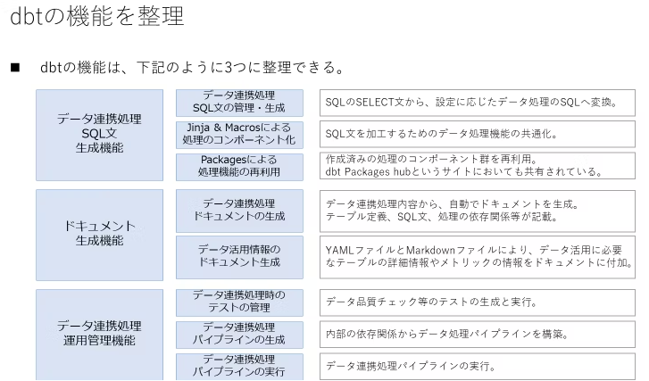

# データ分析を実現するための技術

## この資料の役割

データ分析を実現するためには、エコシステムの恩恵を受ける必要がある。

なぜならば、データ分析界隈の技術は複雑かつ技術スピードは非常に早いため、独自に開発することは、すぐに技術的負債を受けてしまう可能性が高いからである。

そのため、今はどの会社も様々なサービスを組わせてデータ分析を行ない、時代やビジネスの変化に合わせて柔軟に変化してい仕組を整えるのが主流である。

この資料では、**いまよく使われているサービスを整理し、技術選定に役立つための情報を一元管理する**ことで選定時に戦略をもって判断できるようにすることを目的にする。

## 目次

<!-- @import "[TOC]" {cmd="toc" depthFrom=1 depthTo=3 orderedList=false} -->

<!-- code_chunk_output -->

- [データ分析を実現するための技術](#データ分析を実現するための技術)
  - [この資料の役割](#この資料の役割)
  - [目次](#目次)
  - [技術比較表（サマリ）](#技術比較表サマリ)
  - [整理のしかた](#整理のしかた)
  - [データ収集](#データ収集)
    - [Amazon Kinesis Data Streams](#amazon-kinesis-data-streams)
  - [データ保存](#データ保存)
  - [データ加工](#データ加工)
    - [dbt（Data Build Tool）](#dbtdata-build-tool)
  - [データ分析・活用](#データ分析活用)
    - [Google Looker Studio](#google-looker-studio)
    - [Apache Superset](#apache-superset)
    - [雛形](#雛形)

<!-- /code_chunk_output -->

## 技術比較表（サマリ）

TODO:以下で整理した内容をマトリクスで比較表としてまとめる、マトリクス要素については要相談。

## 整理のしかた

データ分析を行うにあたり必要なデータ分析基盤は４つの要素で分類されるため、以下４分類ごとに整理することにする。

- データ収集
- データ保存
- データ加工
- データ分析・活用

※ただし、サービスによっては複数を跨いで対応できる場合があるため、その場合はメイン機能で整理する

---

## データ収集

データ分析のためには、業務システムや顧客データなどから必要なデータを集めます。収集したデータはそのままでは使えないことが多いため、適切に保存し、用途に応じて加工します。

### Amazon Kinesis Data Streams

#### 1. できることの概要

- ストリーミングデータを取得し受け渡すデータ配信システム
  - [ストリーミングデータとは](https://aws.amazon.com/jp/what-is/streaming-data/)
- リアルタイムデータ分析のためのデータ収集
- イベント駆動型アプリケーションの強化

引用元:[Amazon Kinesis Data Streams デベロッパーガイド 用語と概念](https://docs.aws.amazon.com/ja_jp/streams/latest/dev/key-concepts.html)

#### 2. サービスの特徴

- マネージドサービス
- データの順番が保証される
- 暗号化などのセキュリティ要件に対応可能
- 複数のData Streamsを組み合わせてパイプライン構築も可能
- パーティションキーをデータに持たせる必要があるが、それを使って各シャードにデータを振り分けることが可能
  - 各シャードごとにきちんと振り分けないと、一つのシャードに負荷が集中する場合もある。
  
- データIN/OUT
  - データソース
    - データソースをプロデューサーと呼ぶ
      - データプロデューサーは、Amazon Kinesis データストリームに[Amazon Kinesis Data Streams API](https://docs.aws.amazon.com/ja_jp/kinesis/latest/APIReference/API_Operations.html)、[Amazon Kinesis Producer Library (KPL)](https://docs.aws.amazon.com/ja_jp/streams/latest/dev/developing-producers-with-kpl.html)、または [Amazon Kinesis Agent](https://docs.aws.amazon.com/ja_jp/streams/latest/dev/writing-with-agents.html) を介してデータを格納できる。
      - サードパーティーのサービスとつなぐ場合はそれぞれのコネクタも利用可能
        - [参考リンク](https://docs.aws.amazon.com/ja_jp/streams/latest/dev/using-other-services-third-party.html)
  - アウトプット
    - データの送信先をコンシューマーと呼ぶ
    - コンシューマーになれるもの
      - 統合がサポートされているもの
        - Amazon Kinesis Data Firehose
        - Amazon Managed Service for Apache Flink
        - AWS Lambda
      - [Amazon Kinesis クライアントライブラリ（KCL）](https://github.com/awslabs/amazon-kinesis-client)を用いてアプリケーションを作成
      - コネクタライブラリを利用
        - Amazon DynamoDB
        - Amazon Redshift
        - Amazon S3
        - Amazon Elasticsearch Service
  - このほかにもCLIを用いて直接レコードを送り、取得することもできる。[参考](https://docs.aws.amazon.com/ja_jp/streams/latest/dev/fundamental-stream.html)

 引用元:[[初心者向け] Kinesis Data Streams に Lambda でデータを流す様子を理解するために図を書いた](https://dev.classmethod.jp/articles/i-drew-a-diagram-to-understand-how-data-flows-to-kinesis-data-streams-with-lambda/)

#### 3. 価格

- 処理時間に対する従量課金
  - データを入れていなくて処理は発生している。
- オンデマンドとプロビジョニングの選択が可能
- オンデマンド料金
  - ストリーム当たり $0.052/Hour
  - 取り込まれたデータ $0.104/GB
- プロビジョン料金
  - シャード時間 (取得 1 MB/秒、送信 2 MB/秒) $0.0195/Hour
  - PUT ペイロードユニット $0.0215/1000000ユニット

#### 4. 技術的に優れていること

- AWSサービスとの連携:AWSサービスのうちの一つなので、
- 低遅延のデータ配信(70ms)
- 収集したデータを多重かつ、最大365日保存可能
- スケーラビリティがとても高い。

#### 5. 制約事項

- コネクタがないサービスに情報を配信するにはHTTP経由でAPIを叩く必要がある
- 何もしていなくてもお金がかかる

#### 6. 他社事例

- ユーザーログ監視と可視化のための基盤
  - [参考リンク](https://aws.amazon.com/jp/solutions/case-studies/thomson-reuters/)

#### 7. 世の中の評価・評判

- 大規模かつ高速なデータ処理を要求する物はDataStreamsで、そんなに高速である必要がなかったり、データの順番などにこだわりがなければFirehoseを使う人が多いようだった

#### 8. 用途についての所感

- ユーザーの操作ログ取得のような大量のデータを扱うのが得意分野か
- しばらく配信するデータを残しているというのは障害調査などの際に便利かも

#### 9. 備考

- Firehoseとの比較よくされている
  
|     |   Amazon Kinesis Data Streams  |  Amazon Data Firehose   |
| --- | --- | --- |
|   スループットを意識した設計   |  必要 |  不要   |
|   レイテンシ  |   ミリ秒単位  |   秒単位  |
|   配信先  |  処理を行うサービス   |  ストレージにも配信可能   |
|   用途  |  リアルタイム分析   |  遅延が許容される分析   |

#### 10. 参考サイト

- [Amazon Kinesis Data Streams](https://aws.amazon.com/jp/kinesis/data-streams/?nc=sn&loc=0)
- [Amazon Kinesis Data Streams デベロッパーガイド 用語と概念](https://docs.aws.amazon.com/ja_jp/streams/latest/dev/key-concepts.html)
- [[初心者向け] Kinesis Data Streams に Lambda でデータを流す様子を理解するために図を書いた](https://dev.classmethod.jp/articles/i-drew-a-diagram-to-understand-how-data-flows-to-kinesis-data-streams-with-lambda/)
- [ストリーミングデータとは](https://aws.amazon.com/jp/what-is/streaming-data/)
- [Kinesis Data Streams と Kinesis Data Firehose の違いを初心者なりにまとめてみた](https://qiita.com/phenyo_dikgomo/items/22c503a938bec1c9ea36)

---

## データ保存

データ分析に必要なデータは、適切に保存する必要があります。これを「データレイク」と呼びます。データ元によっては一時的なログしか発生しない場合もあり、取得を逃すと再取得が困難です。そのため、必要なデータを収集し、保存しておくことが重要です。

---

## データ加工

データレイクに保存された生データはそのままでは分析に適していないため、適切な形式に加工する必要があります。加工されたデータを保存する場所を「データウェアハウス」と呼びます。さらに、用途に応じて加工・区別されたデータを保存する場所は「データマート」と呼ばれます。これらのデータ加工の工程を「ETL」（Extract, Transform, Load）と呼びます。

### dbt（Data Build Tool）

キーワード：ELTツール

#### 1. できることの概要

dbt Labs社が開発しているデータ連携のELT（データストア内でのデータ変換）の実施をサポートで
OSS版のdbtでも機能が充実しており、データエンジニアの方には一部の機能の利用だけでも価値があるツール

- データウェアハウス内のデータ変換処理をSQLで記述、実行
- データモデルの開発、テスト、ドキュメント化
- データ変換の依存関係管理、自動化
- データ品質の監視、データリネージの可視化

#### 2. サービスの特徴

- SQL中心のアプローチ：SQLに慣れたデータアナリストでも容易に利用可能
- モジュール性、再利用性：データ変換処理をモジュール化し、再利用可能
- テスト機能：データ品質を担保するためのテスト機能を搭載
- ドキュメント自動生成：データモデルのドキュメントを自動生成
- バージョン管理：Gitと連携し、データ変換処理のバージョン管理が可能
- dbt Core(オープンソース)とdbt Cloud(有償SaaS)がある。

[引用元 : データエンジニア界隈で話題のdbt（data build tool）のまとめ](https://qiita.com/manabian/items/67af7e4476d436aded77)

細かい特徴

- データの実体化方法としては、ビューの生成、CTAS（CREATE TABLE AS SLECT）、増分更新、差分更新（MERGE）、差分履歴更新（SCD Type2相当）がある。カスタマイズも可能であり、データ連携先データストアの製品特徴に応じて処理を自動で実施
- SQL文を発行するツールであることから、dbtの実行環境のスケールをあまり考慮する必要はない。データをロードする機能は基本的にはなく、データ連携済みであることが前提。
- 結合キーは単一列であることが推奨されており、複数カラムの値をハッシュ化する方法（[Generating Surrogate Keys Across Warehouses | dbt Developer Blog (getdbt.com)](https://docs.getdbt.com/blog/sql-surrogate-keys)）が紹介されている。
- テスト機能にて、ユニークキー制約性チェック、NOT NULL制約チェック、ドメイン制約、及び、外部キー制約チェックがあり、SQLによりテストケースを作成することが可能。dbtにはデータロード機能がないことから、システムテストの実施は別途必要
- dbt_utils（[dbt - Package hub (getdbt.com)](https://hub.getdbt.com/dbt-labs/dbt_utils/0.1.7/)）などの公開されているパッケージを利用することで、先駆者の知見を拝借可能。
- ドキュメント機能にて、データ連携に関する情報だけでなく、データ活用に関する情報（[Exposures](https://docs.getdbt.com/docs/building-a-dbt-project/exposures) 、[Analyses](https://docs.getdbt.com/docs/building-a-dbt-project/analyses)、[Metrics](https://docs.getdbt.com/docs/building-a-dbt-project/metrics)等）を、yaml、あるいは、Markdownで記述可能。

#### 3. 価格

- dbt Core：オープンソースであり、無償で利用可能
- dbt Cloud:有料のSaaSモデルで、機能とチームのシート数によって価格が変わります。

#### 4. 技術的に優れていること

- SQLに特化：データアナリストのスキルを最大限に活用
- 依存関係管理：データ変換処理の依存関係を自動で解決
- テスト機能：データ品質を担保するためのテスト機能を標準搭載
- ドキュメント自動生成：データモデルのドキュメントを常に最新の状態に保つ
- モダンデータスタックとの親和性：Snowflake、BigQuery、Redshiftなどの主要なクラウドデータウェアハウスとの連携が容易。

#### 5. 制約事項

- SQLの知識が必要：SQLの知識がないと利用が難しい
- 複雑なデータ変換には不向き：複雑なデータ変換には、Pythonなどのプログラミング言語が必要になる場合がある。
- dbt CloudはSaaSであるため、クラウド環境に依存する。

#### 6. 他社事例

- 多くのデータドリブン企業が、データ分析基盤にdbtを採用
  - 例：Netflix,Gitlab,doda,SmartHR

#### 7. 世の中の評価・評判

- データ分析基盤のデファクトスタンダードとして、高い評価を得ている
- データアナリスト、データエンジニアの生産性を向上させるツールとして人気

#### 8. 用途についての所感

- データウェアハウス内のデータ変換、データマート構築に最適
- データ分析基盤の構築、運用効率化に貢献
- データ品質向上、データリネージ可視化など、データガバナンス強化にも有効

#### 9. 備考

- dbt Coreはコマンドラインツール、dbt CloudはWebベースのプラットフォーム
- dbt Learnという教育コンテンツも充実している。

#### 10. 参考サイト

- [dbt Labs](https://www.getdbt.com/)
- [dbt Japan User Group](https://www.getdbt.com/community/local-communities/japan/)
- [dbtとは？｜dbtで始めるデータパイプライン構築〜入門から実践〜 - Zen](https://zenn.dev/dbt_tokyo/books/537de43829f3a0/viewer/what_dbt)
- [データエンジニア界隈で話題のdbt（data build tool）のまとめ](https://qiita.com/manabian/items/67af7e4476d436aded77)
- [ドキュメントの最初のページ。](https://docs.getdbt.com/docs/introduction)
- [dbtがどういったものであるかが説明](https://blog.getdbt.com/what-exactly-is-dbt/)
- [基本チュートリアル。](https://docs.getdbt.com/tutorial/setting-up)
- [dbtに関するよくある質問に対する回答集。](https://docs.getdbt.com/faqs/all)
- [無償のオンライントレーニング。](https://courses.getdbt.com/collections)
- [利用可能なデータストアサービスの記事。](https://docs.getdbt.com/docs/available-adapters)
- [データ活用におけるデータエンジニアリングを実施する際のガイド](https://www.getdbt.com/analytics-engineering/)

---

## データ分析・活用

データウェアハウスに保管されたデータは、そのままでは意味を持ちません。戦略立案や経営判断に役立てるためには、グラフや表にまとめる必要があります。これを行うツールはBIツール（Business Intelligence）と呼ばれます。また、整理されたデータは機械学習にも活用できます。

### Google Looker Studio

[Looker Studio へようこそ](https://cloud.google.com/looker/docs/studio?hl=ja)

キーワード：BI

#### 1. できることの概要

- データ可視化
  - Googleアナリティクス、Google広告、Googleスプレッドシートなど、多様なデータソースからデータを抽出し、グラフや表などの視覚的なレポートを作成できる
  - ドラッグ＆ドロップの簡単な操作で、誰でも美しいダッシュボードを作成できる
- データ共有
  - 作成したレポートは、URLやPDFで簡単に共有できる
  - チームメンバーと共同編集も可能
- リアルタイム連携
  - データソースとリアルタイムで連携し、常に最新の情報を表示できる

#### 2. サービスの特徴

#### 3. 価格

- 基本無料
  - より大規模なデータ分析を行いたい場合にはGoogleの有料BIツールであるLookerを利用

#### 4. 技術的に優れていること

- Googleの強力なインフラ
  - Googleのクラウド基盤を利用しており、高速で安定した動作
- 豊富なコネクタ
  - 多様なデータソースとの接続を可能にするコネクタが用意
- カスタマイズ性
  - 豊富なグラフや表のオプションがあり、細かいカスタマイズが可能

#### 5. 制約事項

- 複雑なデータ分析には不向き
  - Lookerのような高度なデータモデリングや分析機能は備えていない
- 大規模データ処理
  - 非常に大規模なデータセットを扱う場合、パフォーマンスに影響が出る可能性がある

#### 6. 他社事例

- デジタルマーケティングレポート
- ウェブサイトのパフォーマンス分析
- 売上ダッシュボード
- 広告レポート

#### 7. 世の中の評価・評判

- 「無料なのに高機能で使いやすい」
- 「データの可視化が簡単にできるので、重宝している」
- 「チームでの情報共有がスムーズになった」
- 「データに基づいた意思決定がしやすくなった」

#### 8. 用途についての所感

- Google アカウントが必要なので社内利用には向いている
- データ分析の専門家でなくても、簡単にデータを可視化し、共有できるのは強み
- 機密情報の扱いは調査が必要
- 案件で利用することはセキュリティーと仕組み上厳しい（とりあえず見せるなどは可能かと）

#### 9. 備考

- 以前は「Googleデータポータル」という名称でしたが、2022年10月に「Google Looker Studio」に名称変更された

#### 10. 参考サイト

- [Looker Studio へようこそ | Google Cloud](https://cloud.google.com/looker/docs/studio?hl=ja)
- [GoogleのLooker Studioとは？機能やメリット、使いこなすコツを解説！ - SEOタイムズ:](https://seotimes.jp/looker-studio/)
- [【初心者向け】図解あり！Google Looker Studioの使い方を解説 - PLAN-B:](https://www.plan-b.co.jp/blog/seo/31762/)

### Apache Superset

### 雛形
<!-- markdownlint-disable MD022 -->
#### 1. できることの概要
#### 2. サービスの特徴
#### 3. 価格
#### 4. 技術的に優れていること
#### 5. 制約事項
#### 6. 他社事例
#### 7. 世の中の評価・評判
#### 8. 用途についての所感
#### 9. 備考
#### 10. 参考サイト
<!-- markdownlint-enable MD022 -->