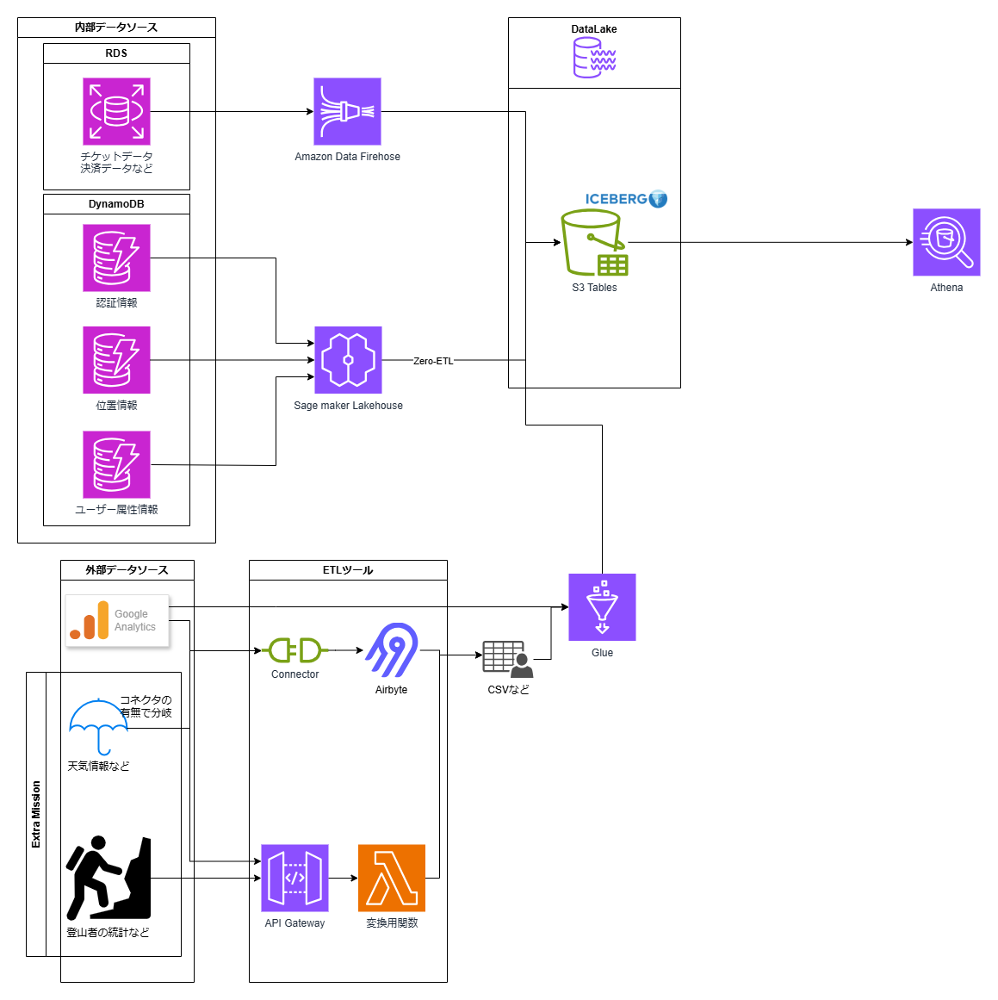

# データ分析基盤構成案

## 1. 概要

本ドキュメントは、富士山入山管理システムに関するデータ分析基盤の構成案です。

## 2. 全体構成図

## 3. 構成要素

### 3.1 データソース

#### 3.1.1

- RDS for PostgreSQL
  - 決済関連データ
- DynamoDB
  - Fuji Naviアプリ関連のユーザー属性情報など

#### 3.1.2 外部データソース（API, CSV等）

- Google Analytics
- 天気予報
- 静岡県提供の情報
- その他

### 3.2 データ蓄積

- データレイクハウス
  - Amazon S3 Tables
  - Apache Iceberg

S3 Tablesは、Apache IcebergをフルマネージドでS3上に構築できるAWSのサービスです。

#### Apache Icebergとは？

Apache Icebergは、クラウドネイティブな大規模データ分析向けのテーブル形式です。スキーマの進化やタイムトラベル、隠しパーティション（Hidden Partitioning）、ACIDトランザクションのサポートなどにより、データレイク上で信頼性の高いデータ管理を実現します。また、AthenaやSpark、Prestoなど複数の分析エンジンと連携できるため、拡張性と運用性に優れています。

##### ACIDトランザクション

ACIDトランザクションとは、データベースにおける信頼性を確保するための4つの特性（Atomicity：原子性、Consistency：一貫性、Isolation：独立性、Durability：永続性）を指します。Icebergはこれらをサポートすることで、複数ユーザーやプロセスによる同時書き込みや障害発生時でも、データの整合性と信頼性を維持できます。
これにより、従来のデータレイクで発生していたデータの一部分書き換えの困難さや、データの細分化によるクエリ速度の低下といった問題を解決できます。

##### 隠しパーティション（Hidden Partitioning）

従来のデータレイクではパーティショニングを行う際、以下のような課題がありました。

1. 手動でパーティショニングの設定をする必要がある
2. クエリ時に手動でパーティショニングが効くようにSQLを調整する必要がある
3. 新しいパーティショニングを作成する際、全データのディレクトリ再配置が必要になる

Icebergでは、

1. メタデータとして自動でパーティショニングを作成
2. クエリ時に自動でパーティショニングが効くように変換
3. メタデータに書き込むことで新しいパーティショニングを追加可能

この手法をHidden Partitioningといいます。

##### スキーマの進化

従来のデータレイクでは、スキーマの変更には全データの書き換えが必要でした。
Icebergはスキーマの作成・削除・変更を後から行えるように設計されており、柔軟性に優れています。

##### タイムトラベル

機械学習などで同じデータセットを使用する様々なユースケースに対応するため、Icebergは全てのタイミングのスナップショットを残し、任意の時点のデータをクエリできます。
また、データベース破損時のロールバックも可能です。
ただし、スナップショットを無制限に残すと保存データ量が増大するため、定期的なメンテナンスが必要です。

### 3.3 データ加工・ETL

- RDS for PostgreSQL
  - Amazon Data Firehoseを経由しIcebergテーブルに保存します。
- DynamoDB
  - Amazon SageMaker LakehouseのZERO-ETLを利用しIcebergテーブルに保存します。

#### 選定理由

RDS for PostgreSQLはIcebergテーブルに対してフルマネージドで保存できるためです。
DynamoDBも同様にフルマネージドで保存が可能です。

### 3.4 データ分析

- Athenaによるクエリを前提とします。

## 4. セキュリティ・運用

- アクセス制御
- ログ管理
  - AWS Lake Formationを採用したいと考えています。
- バックアップ・リカバリ
  - バックアップはS3の信頼性を頼ります。
  - 誤操作時のリカバリはIcebergのタイムトラベル機能を活用予定です。

### AWS Lake Formationとは？

AWS上でデータレイクの構築・管理・セキュリティ制御を簡素化するサービスです。データの収集、カタログ化、アクセス権限の細かな管理（きめ細かいアクセスコントロール）、監査ログの取得などを一元的に実現できます。これにより、データの利用者ごとにアクセス権限を柔軟に設定し、セキュアかつ効率的なデータ分析基盤の運用が可能となります。

## 5. 要検討部分

### Athenaでのクエリ以降の分析・可視化について

SQLによるクエリは可能ですが、クエリ後の分析内容やその可視化方法などについては未定です。

### 外部データソース（サードパーティ）の扱いについて

Google AnalyticsについてはIcebergテーブルへの直接書き込みを断念すればAirbyteの利用が可能です。
Glueでの直接読み込みも検討中です。
その他にも取得したい情報が多いため、包括的にうまく扱う方法を検討する必要があります。

### 外部データソース（ユーザーデータ）の扱いについて

ユーザーから受領したデータはETL処理を自作してデータレイク内に入れる必要があります。
共有データレイク内への格納は避け、データメッシュの考え方でドメインごとに管理し、中央カタログが参照する形が良いかと思われます。

### 権限管理について

Lake Formationの採用で最低限のガバナンスは担保できますが、詳細なルール策定は運用側で対応が必要です。

## 6. 参考文献・リンク

- [Amazon Data Firehose を使用して、データベースから Apache Iceberg テーブルに変更をレプリケート (プレビュー)](https://aws.amazon.com/jp/blogs/news/replicate-changes-from-databases-to-apache-iceberg-tables-using-amazon-data-firehose/)
- [ICEBERGのパーティションについて](https://zenn.dev/nuku/scraps/7e29e8ee966a53)
